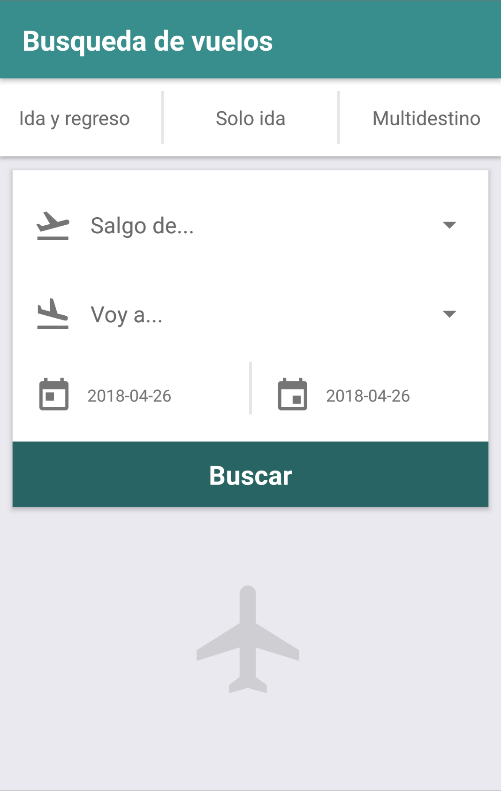
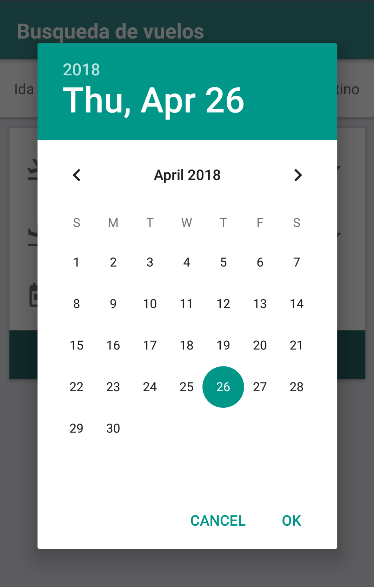
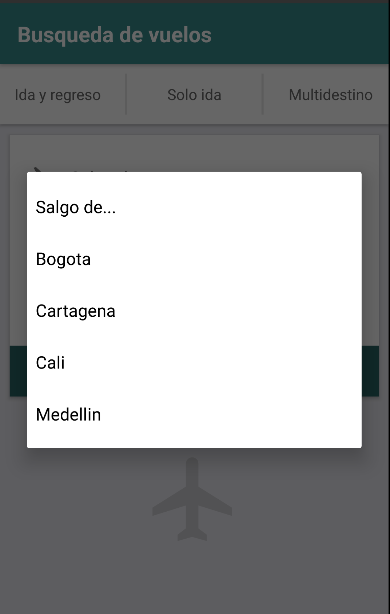
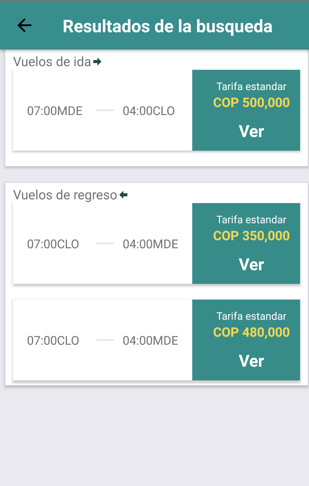
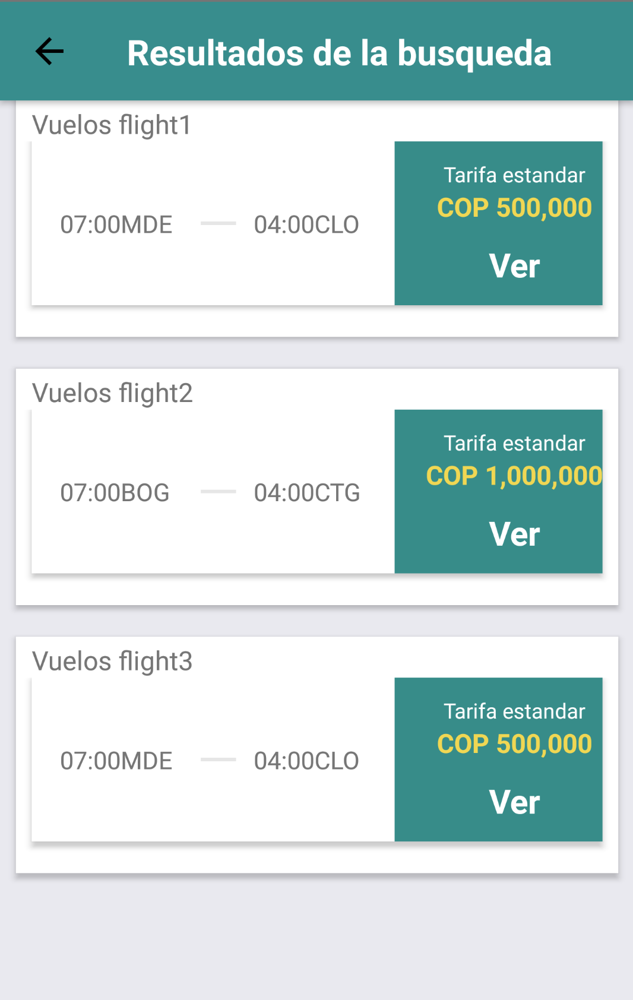
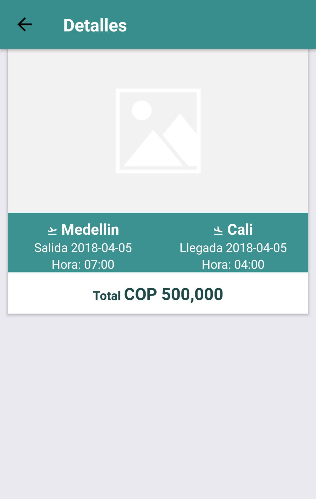

# Mobile - Vuelos
Este repositorio contiene el front mobile para la prueba de Almundo.com, el cual consiste una ventana de busqueda con 3 opciones principales, busqueda de un vuelo de solo ida, busqueda de un vuelos ida y regreso, y finalmente vuelos multidestinos. Contienen vistas de detalle para conocer la informacion especifica de cada vuelo.

## Equipo
- Daniel Charry 

## Instalación
Primero se debe clonar el proyecto <kbd>**SSH:** git@gitlab.com:dacharry/mobile-vuelos.git</kbd>, entrando en la carpeta clonada se intalan las dependencias del proyecto con <kbd>npm i</kbd>, luego, teniendo un emulardor de Android ejecutaremos el comando <kbd>react-native run-android</kbd>, de esta manera la aplicación se instalara en el emulador para ser presentada.

## Nota
Si se desea probar todas las funcionalidades de la aplicación, correr en conjunto con el repositorio del api-vuelos, el front mobile escucha por el puerto :3004 por defecto

## Capturas Pantalla

